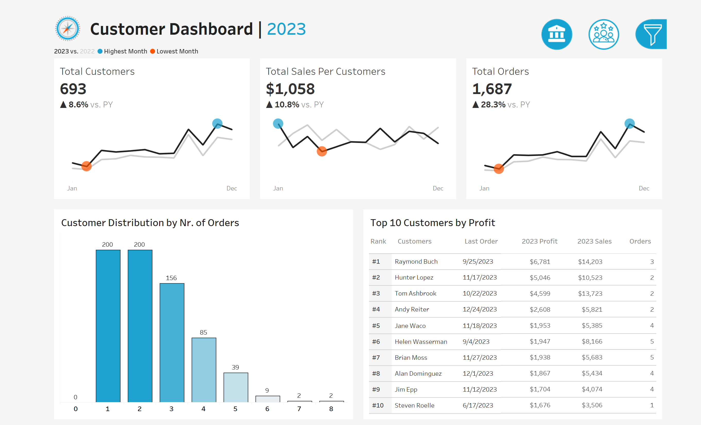

# Customer-Segmentation-Analysis

## 📌 Introduction
This Tableau project consists of two interactive dashboards designed to help sales managers, executives, and marketing teams analyze sales performance and customer behavior. The dashboards provide key insights into revenue trends, product performance, and customer engagement, allowing stakeholders to make data-driven decisions.

## 🎯 Project Objectives
- Provide a **year-over-year comparison** of sales and customer data.
- Analyze **sales trends, product performance, and customer segmentation**.
- Identify **top-performing customers** based on profitability.
- Offer **interactive filters** for in-depth analysis.
- Enhance decision-making for **sales and marketing teams**.

## 🖥️ Dashboard Links
🔗 **[View the Live Tableau Dashboard](https://public.tableau.com/app/profile/sakshi.ahuja3466/viz/SalesCustomerDashboard_17414468898810/SalesDashboard?publish=yes)**  

---

## 📊 Sales Dashboard  
### **Purpose**
The Sales Dashboard provides an **overview of sales performance** to analyze trends and profitability.

### **Key Features**
✔ **KPI Overview** – Displays **total sales, profit, and quantity** for the current and previous year.  
✔ **Sales Trends** – Shows **monthly** sales performance for both years.  
✔ **Product Subcategory Analysis** – Compares **sales and profit** across product categories.  
✔ **Weekly Trends** – Highlights **weekly sales and profit fluctuations**, identifying **above and below-average weeks**.  

### **Sales Dashboard Preview**  

---

## 🛒 Customer Dashboard  
### **Purpose**
The Customer Dashboard provides insights into **customer trends and purchasing behavior**, helping teams improve customer retention and sales strategies.

### **Key Features**
✔ **KPI Overview** – Displays **total number of customers, sales per customer, and total orders**.  
✔ **Customer Trends** – Highlights **monthly customer behavior** and sales trends.  
✔ **Customer Segmentation** – Analyzes the **distribution of customers based on order volume**.  
✔ **Top 10 Customers** – Identifies the **most profitable customers**, along with **sales, orders, and last purchase date**.

### **Customer Dashboard Preview**  

---

## 🎨 Design & Interactivity
- **Dynamic Year Selection** – Users can select different years for historical analysis.  
- **Drill-down Filters** – Interactive filters for **category, subcategory, region, state, and city**.  
- **Navigation** – Easy switching between Sales and Customer dashboards.  

---

## 📂 Dataset Used
The dataset used for this project contains **sales and customer transaction data**. It includes:
- **Sales Metrics** (Total Sales, Profit, Quantity)
- **Customer Information** (Customer ID, Order Count)
- **Product Details** (Category, Subcategory)
- **Geographical Data** (Region, State, City)

📌 The dataset was cleaned and transformed in **Tableau** before visualization.

---

## 🛠️ Technologies Used
- **Tableau Public** – Data visualization and dashboard creation  
- **Excel/CSV** – Data source  
- **GitHub** – Project hosting  

---

## 🚀 How to Use This Project
### **1️⃣ Access the Dashboard**
Click on the link to interact with the dashboards:  
🔗 **[Tableau Dashboard](https://public.tableau.com/app/profile/sakshi.ahuja3466/viz/SalesCustomerDashboard_17414468898810/CustomerDashboard?publish=yes)**  

